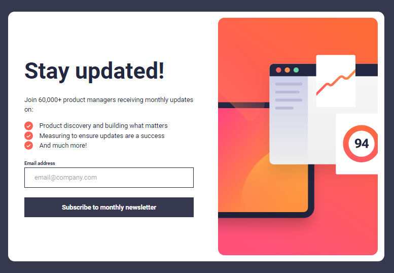

# Frontend Mentor - Newsletter sign-up form with success message

This is a solution to the [Newsletter sign-up form with success message challenge on Frontend Mentor](https://www.frontendmentor.io/challenges/newsletter-signup-form-with-success-message-3FC1AZbNrv). Frontend Mentor challenges help you improve your coding skills by building realistic projects.

## Table of contents

- [Overview](#overview)
  - [Screenshot](#screenshot)
  - [Links](#links)
- [My process](#my-process)
  - [Built with](#built-with)
  - [What I learned](#what-i-learned)
  - [Continued development](#continued-development)
  - [Useful resources](#useful-resources)
- [Author](#author)
- [Acknowledgments](#acknowledgments)

## Overview

### Screenshot

### Links

- Solution URL: [https://github.com/mehdias63/Newsletter-sign-up-with-success-message-main]
- Live Site URL: [https://newsletter-sign-up-with-success-message-main-bice.vercel.app/]

## My process

### Built with

- [React](https://reactjs.org/) - JS library
- [Tailwind](https://tailwindcss.com/) - For styles
